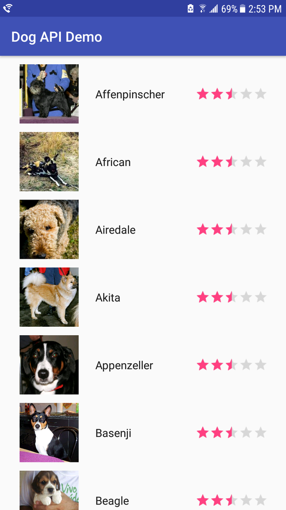
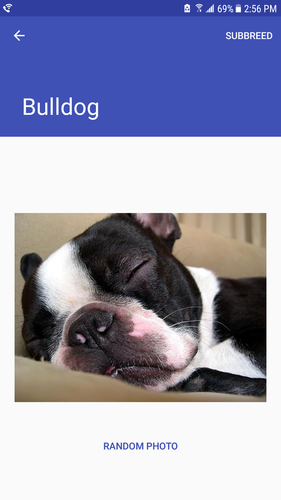
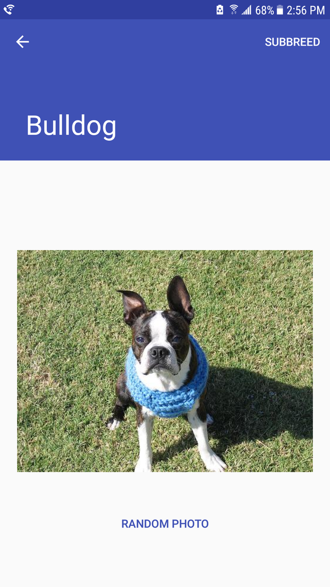
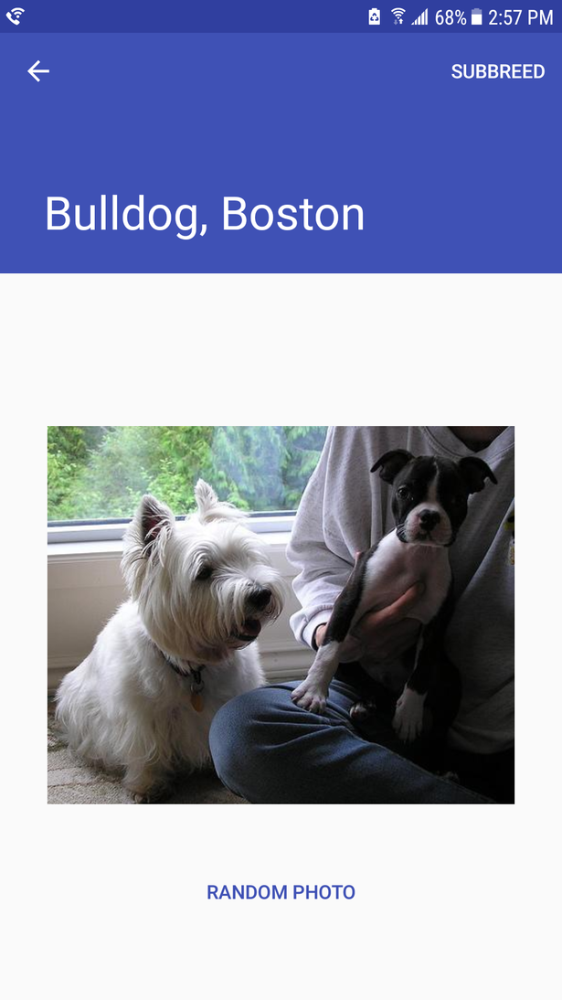
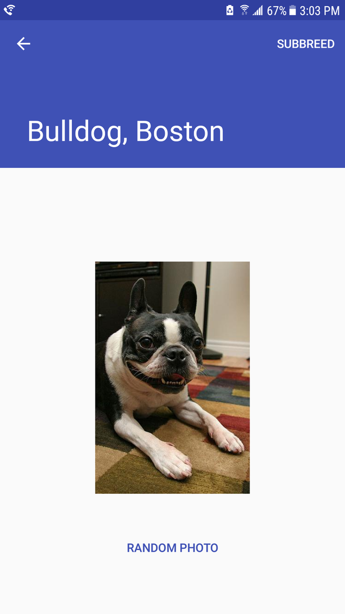
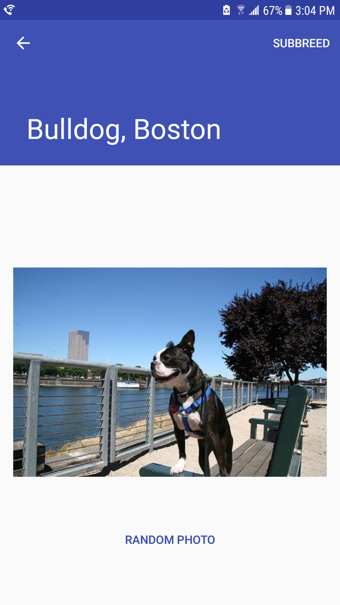

# Dog API Demo
### A demo of Name Days API
This app demonstrates GET requests to expose the [DOG API](https://dog.ceo/dog-api/)

#### Android
- Uses RecyclerView to hold list
- Uses [Universal Image Loader](https://github.com/nostra13/Android-Universal-Image-Loader) to both cache and display images
- Memory-aware

#### Code

Configure the memory cache
    
    if (!ImageLoader.getInstance().isInited()) {
          ImageLoaderConfiguration config = new ImageLoaderConfiguration.Builder(getApplicationContext())
                  .memoryCacheSize(25000000)
                  .build();
          ImageLoader.getInstance().init(config);
     }
    
Load a bitmap into a view from an endpoint
    
    // First, configure the bitmap
    DisplayImageOptions thumbOptions = new DisplayImageOptions.Builder()
              .cacheInMemory(true)
              .imageScaleType(ImageScaleType.EXACTLY) // Sample the image to thumbnail size to reduce memory
              .bitmapConfig(Bitmap.Config.RGB_565)
              .build();         
             
    // Then, load the image from url into a wrapped view
    imageLoader.displayImage(
             url,
             new ImageViewAware(holder.mContentView, false),
             thumbOptions);  
             
Respond to state of application memory

    public void onTrimMemory(int level) {
        if (level >= ComponentCallbacks2.TRIM_MEMORY_MODERATE) {
            ImageLoader imageLoader = ImageLoader.getInstance();
            if (imageLoader.isInited()) {
                imageLoader.getMemoryCache().clear();
            }
        }
        super.onTrimMemory(level);
    }                                   
         

### See the Breeds
Rate your favorites!

### Fetch random photos of a Breed

### Refine the content by choosing Subbreed

